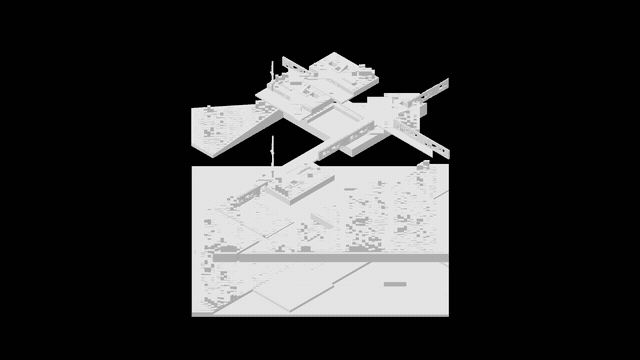
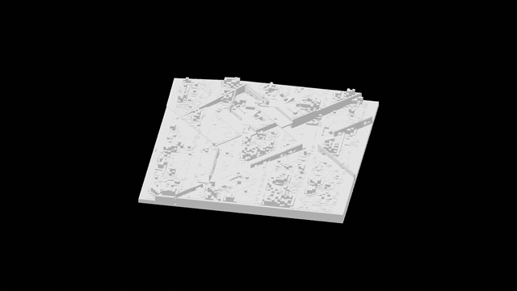
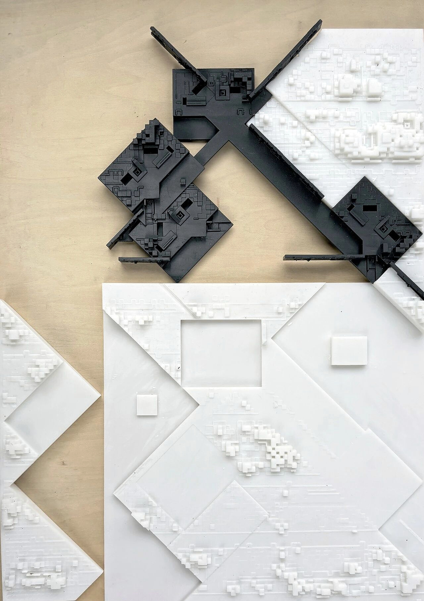

# Cubist Fountain

**AI-Assisted Visual-to-Parametric Design Workflow**

An experiment in translating visual design intent into editable geometry and a fabricated physical prototype.



*Assembly — modular components move vertically into the final composition.*



*Rotation — the completed model shown through one continuous turn.*

## Overview

Cubist Fountain explores how multimodal AI can assist the translation from an abstract visual reference to parametric architectural geometry. Instead of asking a model to generate a final form directly, the workflow introduces an intermediate representation: explicit geometric rules describing hierarchy, orientation, repetition, scale, and offset relationships. These rules can be reviewed before they are implemented in Grasshopper and GhPython, making the resulting geometry easier to inspect and modify. This keeps design intent legible across the transition from image analysis to code and fabrication. The project was developed as an experiment in AI-assisted design reasoning and was ultimately tested through a fabricated physical prototype.

**Visual Reference → Design Rules → Parametric Geometry → Physical Prototype**

## Workflow

| Stage | Input | Output |
| --- | --- | --- |
| **01 Visual Reference** | One selected abstract composition | Dominant geometry, axes, hierarchy, and spatial relationships |
| **02 Prompt & Design Rules** | Structured multimodal prompt | A deterministic rule set with fixed values and editable parameters |
| **03 Parametric Generation** | Confirmed rules | Grasshopper / GhPython geometry that can be inspected and adjusted |
| **04 Physical Prototype** | Fabrication-ready geometry | A physical test of scale, assembly, and spatial composition |



*Physical prototype studies. The photograph received conservative noise, color, and contrast correction; its geometry was not reconstructed.*

## How It Works

The workflow does not directly map an image to code. It uses a reviewable design representation between visual interpretation and implementation:

```text
Visual Reference
      ↓
Geometric Rules
      ↓
Parametric Logic
      ↓
Editable Geometry
```

A compact rule set can be represented as structured data before any geometry is generated:

```json
{
  "composition": "fragmented radial assembly",
  "modules": [
    "rectangular plates",
    "linear walls",
    "raised blocks"
  ],
  "operations": [
    "rotation",
    "offset",
    "scaling",
    "layering"
  ],
  "constraints": [
    "deterministic placement",
    "editable parameters"
  ]
}
```

This intermediate layer makes a visual interpretation inspectable before it becomes code. Incorrect assumptions can be corrected at the rule level instead of being discovered after a complete Grasshopper definition has been generated.

## Prompt Template

The final prompt is organized around four tasks:

1. Visual decomposition
2. Geometric abstraction
3. Spatial relationship extraction
4. Parametric implementation guidance

<details>
<summary>View the final prompt</summary>

```text
# Role
You are an architectural form analyst experienced in shape grammar,
parametric design, Grasshopper, and GhPython.

# Task
Analyze one supplied visual reference and translate its composition into
a deterministic set of geometric rules that can be implemented as
editable parametric geometry.

# Constraints
- Describe geometry and operations, not aesthetic impressions.
- Every conclusion must correspond to an action such as rotate, offset,
  scale, array, align, intersect, subtract, or extrude.
- Estimate quantities, angles, proportions, and relative dimensions.
- Separate fixed values from editable parameters and give parameter ranges.
- Use 4–6 rules. Avoid uncontrolled randomness; use a seed only when a
  reproducible variation is required.
- Distinguish independent geometric systems before describing how they
  intersect, overlap, or connect.

# Input
- One visual reference
- Intended scale and model units
- Rhino version and GhPython environment
- Optional fabrication constraints

# Output
1. A concise composition overview.
2. A list of initial geometric primitives.
3. A rule table with: object, operation, fixed value / parameter, range,
   and expected spatial effect.
4. Grasshopper / GhPython implementation guidance.
5. A short verification checklist for comparing the generated geometry
   with the original visual logic.

# Verification
Before answering, confirm that every rule can be implemented as a concrete
geometric operation, every parameter has a usable range, and no essential
instruction depends on vague stylistic language.
```

</details>

The standalone version is available in [`prompts/visual-to-parametric.md`](prompts/visual-to-parametric.md).

## Implementation

- Rhino
- Grasshopper
- GhPython
- Multimodal LLM
- 3D printing and physical assembly

Repository assets:

- [`assets/`](assets/) — assembly and rotation GIFs, plus the prototype photograph
- [`prompts/`](prompts/) — the final visual-to-parametric prompt template

## Outcome

The project demonstrates a lightweight workflow for using AI as an intermediary between visual design intent and parametric modeling. Rather than treating AI as an autonomous form generator, the experiment focuses on converting visual features into explicit, editable rules that can be reviewed, implemented, and fabricated.

Released under the [MIT License](LICENSE).
