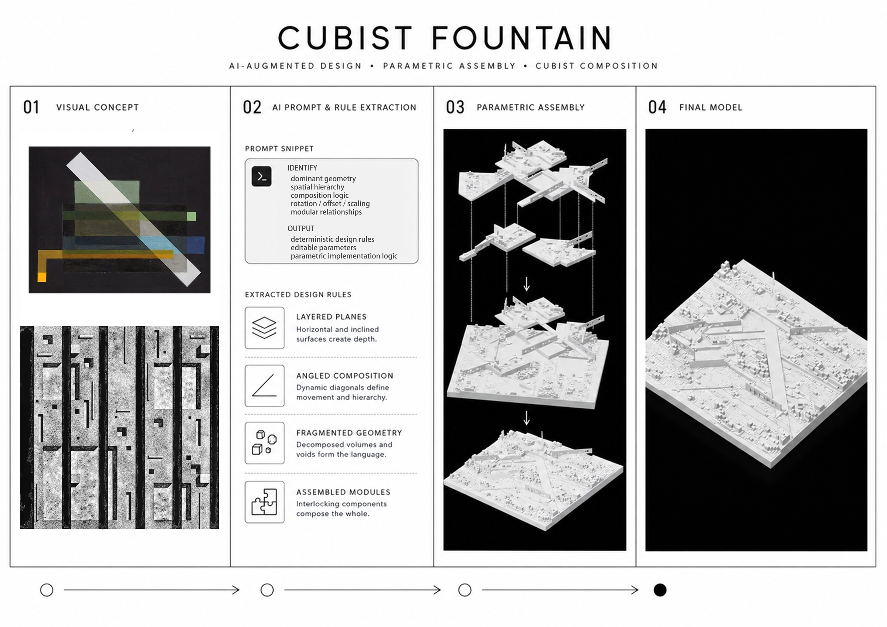

# Cubist Fountain

> 从视觉参考到可编辑参数化几何与实体模型——一套 AI 辅助的设计转译工作流。


<p align="center">
  
</p>

<a id="overview"></a>
## 📖 项目概览

Cubist Fountain 探索多模态 AI 如何辅助设计师将抽象视觉参考转译为参数化建筑几何。项目并不要求 AI 直接生成最终形态，而是在图像理解与代码实现之间加入一层可检查的中间表示：明确的几何规则、空间关系与可调参数。

这些规则首先由设计师审核，再进入 Grasshopper / GhPython 实现，从而让生成结果更容易解释、修改和继续发展。最终几何通过 3D 打印与实体装配进行验证，形成一条完整的设计链路：

**视觉参考 → 几何规则 → 参数化逻辑 → 可编辑几何 → 实体原型**

<a id="showcase"></a>
## 🎬 成果展示

<table>
  <tr>
    <th>Assembly｜模块拼合</th>
    <th>Rotation｜旋转展示</th>
  </tr>
  <tr>
    <td align="center"></td>
    <td align="center"></td>
  </tr>
  <tr>
    <td align="center">模块沿垂直方向逐步落位，形成最终构图。</td>
    <td align="center">完整模型进行一轮连续旋转，展示整体形态与空间层次。</td>
  </tr>
</table>

### Physical Prototype｜实体原型

<p align="center">
  
</p>

实体模型及构件研究。照片仅进行了保守的降噪、色彩与对比度校正，未重构模型几何。

## 📑 目录

- [项目概览](#overview)
- [成果展示](#showcase)
- [Part I：AI 辅助参数化设计工作流](#workflow)
  - [01 视觉推理](#visual-reasoning)
  - [02 设计语法提取](#design-rules)
  - [03 代码生成](#code-generation)
  - [04 AI 渲染](#ai-rendering)
  - [05 3D 打印](#fabrication)
- [核心方法](#method)
- [实现工具](#implementation)
- [项目成果](#outcome)

<a id="workflow"></a>
# Part I：AI 辅助参数化设计工作流

> 以下保留每个阶段最终使用的主线 Prompt。
>
> ①、②、③ 建议在同一场对话中依次完成，使视觉分析、规则清单与代码生成保持上下文连续。

<a id="visual-reasoning"></a>
## 01 🔍 视觉推理

让 AI 读取参考图像中的**几何逻辑**，而不是输出美术赏析。该阶段的产物是一份能够被设计师检查、也能够继续进入参数化建模的构成规则分析。

```text
# Role
你是一位精通建筑形式分析的建筑学者，熟悉参数化设计与形状文法
（Shape Grammar），擅长将绘画、平面图和照片拆解为可执行的几何逻辑。

# Task
分析我上传的一张视觉参考，提取其几何生成逻辑，输出一份可供参数化
建模使用的“构成规则分析”。这不是美术赏析，而是一份生成说明书：
没有看过原图的人，也应该能够依据它重建大致构成。

# Constraints
1. 禁止散文式风格描述。每条结论必须对应偏移、旋转、阵列、镜像、
   缩放、布尔、拉伸或对齐等具体几何操作。
2. 所有角度、比例和数量给出估计数值，不使用“稍微”“富有张力”
   等无法执行的描述。
3. 分析必须覆盖四个维度：
   - 分割方式：基础几何如何划分画面；
   - 比例关系：关键元素的尺寸比例与尺度跨度；
   - 轴线与网格：控制轴线、正交网格或局部旋转坐标系；
   - 节奏与递归：重复、嵌套和逐层变化的规律。
4. 如果图像包含多个几何子系统，分别描述规则，再说明它们如何穿插、
   咬合、相交或连接。
5. 一次只分析一张主要参考图。

# Execution Protocol
输出前检查：
1. 每条结论后能否接上一个明确的几何动词？
2. 四个分析维度是否都包含数值或比例？
3. 没看过原图的人能否依据分析画出大致构成？

# Input
- 一张视觉参考：绘画、平面图或照片
- 参考图的背景与希望提取的设计方向
- 可选：目标尺度、场地或功能限制

# Output
1. 不超过 100 字的整体构成概述。
2. 按四个维度组织的规则清单：
   规则名 + 几何描述 + 估计数值。
3. 三个可参数化变量：
   变量名 + 控制特征 + 建议取值范围。
```

<a id="design-rules"></a>
## 02 🧩 设计语法提取

把视觉分析进一步整理成一份**可执行的生成规则清单**。这份清单是图像理解与代码生成之间的关键中间层。

```text
# Role
你是一位参数化设计方法专家，熟悉形状文法、Grasshopper 与规则驱动
建模。你认为只有能够用明确规则说明的设计，才适合继续转译为代码。

# Task
基于上一步的图像构成分析，将其转译成一份“可执行的生成规则清单”。
该清单是下一步生成代码的唯一依据。

# Constraints
1. 清单由两部分组成：
   A. 初始词汇（Initial Vocabulary）
      - 允许使用的基础几何不超过五种；
      - 每种几何注明尺寸模数或相对比例。
   B. 生成规则（Rules）
      - 每条写成：
        Rule N — 名称：作用对象 + 几何操作 + 参数。
2. 每条规则必须区分固定值与可调参数；可调参数给出建议范围。
3. 规则总数控制在 4–6 条。
4. 禁止不受控制的随机撒点和随机旋转。如需变体，只使用 seed 控制
   可复现的初始分配，几何规则本身保持确定性。
5. 每次几何叠加都必须伴随明确操作，例如并、差、交、对齐或咬合。
6. 若设计涉及挖空，必须说明切刀、被切对象、方向与深度。

# Execution Protocol
输出前检查：
1. 每条规则是否都能直接转译为代码？
2. 每条规则是否标注固定值、参数和参数范围？
3. 是否存在无法复现的随机性？
4. 规则是否足够少且聚焦？

# Input
- 上一步的构成规则分析
- 设计目标、目标尺度与模型单位
- 可选：制造、结构或场地限制

# Output
生成一张规则清单表格：

| 编号 | 规则名 | 作用对象 | 几何操作 |
| 固定值 / 参数（含范围） | 预期空间效果 |
```

<a id="code-generation"></a>
## 03 💻 代码生成

将确认后的规则清单翻译为 Grasshopper / GhPython 逻辑。代码需要忠实对应规则，而不是重新解释设计。

```text
# Role
你是一位熟悉 Rhino / Grasshopper 二次开发的参数化工程师，了解 Rhino 7
IronPython 与 Rhino 8 Python 3 的 API 差异，并熟悉布尔运算、类型提示、
数据树和几何容差问题。

# Task
根据下方“生成规则清单”，编写可在 Grasshopper GhPython 组件中运行的
脚本，参数化地生成目标几何。规则清单中的每条 Rule 都必须在代码注释
中找到对应实现。

# Constraints
1. 开始前锁定环境：
   - Rhino 版本：7 或 8；
   - 组件类型：IronPython 或 Python 3；
   - 模型单位。
   不得混用不同版本的 API。
2. 所有可调参数集中在组件输入端，并提供安全默认值。
3. 逐一说明每个输入端的名称、Type Hint、默认值和建议范围。
4. 墙厚、构件厚度、柱径等制造尺寸使用绝对数值，不随场地比例缩放。
5. 布尔运算按以下顺序保证稳定：
   - 切割体穿透被切体，避免共面；
   - 多条曲线逐条循环处理；
   - 若布尔仍不稳定，改用直接生成构件的零布尔策略。
6. seed 只控制可复现的初始分配，不改变规则逻辑。
7. 代码注释标明每一段对应 Rule N。

# Execution Protocol
输出前检查：
1. 每个输入端是否给出正确的 Type Hint？
2. 是否存在把列表直接传入只接受单个几何的函数？
3. 绝对尺寸、单位和容差是否统一？
4. 每条 Rule 是否都有对应代码段？
5. 输出端是否能够在 Grasshopper 中直接预览或 Bake？

# Input
- 已确认的生成规则清单
- Rhino 版本与 GhPython 组件类型
- 输入端：参数名、类型、默认值、范围
- 输出端：输出名与预期数据类型

# Output
1. 完整可运行的 Python 代码。
2. 输入端接线说明：
   名称 + Type Hint + 默认值 + 范围。
3. 输出端名称与内容。
4. 一句预期形态描述，用于核对方向是否跑偏。
```

<a id="ai-rendering"></a>
## 04 🎨 AI 渲染

将 Rhino / Grasshopper 素模转化为展示图。该阶段的优先级是**保持几何真实**，材质与氛围位于其后。

```text
# Role
You are an architectural visualization specialist. Treat the uploaded model
screenshot as the absolute truth of the design: add materials, light and
atmosphere, but never redesign its geometry.

# Task
我上传的是 Rhino / Grasshopper 参数化模型截图。请将它转化为建筑展示图：
严格保持几何形态、体块关系和相机视角，只调整材质、光照、环境与氛围。

# Constraints
1. 几何锁定（最高优先级）：
   - Keep the geometry, massing, openings and proportions EXACTLY as shown.
   - Do not add, remove, move or reshape any element.
   - Keep the camera position, view angle and perspective unchanged.
2. 材质必须使用具体名称，例如 exposed concrete、corten steel、
   brushed brass、oiled oak 或 rammed earth。
3. 未在材质表中指定的构件保持素模状态，不自行赋予新材质。
4. 光照从 golden hour、overcast soft light 或 sharp morning light
   中选择，阴影方向必须与主光源一致。
5. 人物只作为尺度参照，数量不超过三人，不遮挡主体。
6. 禁止文字、水印、过曝、扭曲人物和模型中不存在的构件。
7. 默认采用 photorealistic architectural photography；若需要拼贴或
   手绘风格，必须在输入中明确指定。

# Execution Protocol
出图前检查：
1. 体块数量、轮廓、开口和交接是否与截图一致？
2. 所有材质是否都来自输入的材质表？
3. 相机视角与透视是否保持不变？
4. 配景是否只承担尺度与氛围作用？

# Input
- 一张干净的模型截图
- 构件与材质对应表
- 视角与光照要求
- 场地背景
- 可选：展示风格

# Output
1. 一张与原截图构图一致的展示图。
2. 50 字以内的自查说明：
   确认哪些几何保持不变，以及实际添加了哪些材质。
```

<a id="fabrication"></a>
## 05 🖨️ 3D 打印

参数化几何在输出实体模型前，需要从视觉逻辑转换为可制造几何。

- 确认所有实体封闭且法线方向一致。
- 检查最小壁厚、悬挑角度与细长构件的稳定性。
- 避免共面、自交、裸边和尺寸小于打印精度的细节。
- 核对 Rhino 文件单位、输出单位与最终缩尺。
- 检查底座接地面积以及模型重心。
- 根据打印方向评估支撑数量和表面质量。
- 将过长或脆弱构件拆分为可装配模块。
- 导出 STL 前再次检查整体尺寸与网格质量。

<a id="method"></a>
## 🧠 核心方法

工作流并不直接把图像映射为代码，而是引入一层可以由设计师审核的中间表示：

```text
视觉参考
   ↓
几何规则
   ↓
参数化逻辑
   ↓
可编辑几何
   ↓
实体原型
```

例如，构图规则可以先被记录为结构化数据：

```json
{
  "composition": "fragmented radial assembly",
  "modules": [
    "rectangular plates",
    "linear walls",
    "raised blocks"
  ],
  "operations": [
    "rotation",
    "offset",
    "scaling",
    "layering"
  ],
  "constraints": [
    "deterministic placement",
    "editable parameters"
  ]
}
```

这种中间层让视觉误读可以在规则阶段被纠正，而不必等到完整代码和几何生成后再返工。

<a id="implementation"></a>
## 🛠️ 实现工具

- Rhino 8
- Grasshopper
- GhPython
- Multimodal LLM
- 3D printing and physical assembly

<a id="outcome"></a>
## 🎯 项目成果

Cubist Fountain 展示了一种轻量的 AI 辅助设计方法：AI 不被当作自动造型工具，而是作为视觉设计意图与参数化建模之间的转译媒介。视觉特征先被转换为明确、可编辑和可验证的设计规则，再进入代码实现与实体制造。

本项目基于 [MIT License](LICENSE) 发布。
